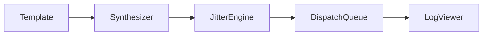

# fts-tool 💸🧪

  

*A sandbox transaction simulator that lets you rehearse the chaos of payment flows before real money ever gets involved.*

  

## 🌱 Overview

I built fts-tool because I got tired of testing payment integrations against production rails, staging environments that lied to me, and mock servers that fell over the moment I needed something realistic. A **Fake Transaction Sender** isn't about deception — it's about giving developers, QA engineers, and fintech tinkerers a safe, fully synthetic transaction stream they can shape however they need. Think of it as a wind tunnel for money movement: nothing that leaves it is real, but everything that flows through it behaves like it could be.

This started as a weekend itch-scratch and turned into a genuine passion project. I wanted a tool that felt native to Windows, launched instantly, and didn't demand a dozen dependencies just to send a simulated transfer object across a local pipe. Every screen, every shortcut, every little animation in fts-tool was tuned by hand because I actually use this thing daily to test webhook listeners, reconcile ledger logic, and stress my own APIs with believable-but-fake transaction payloads.

Who is this for? QA teams validating payment gateways without touching live rails. Backend developers wiring up transaction listeners who need repeatable, deterministic test data. Educators teaching how transaction lifecycles work. Hobbyists building their own mock banking dashboards. If you've ever thought "I just need one fake transaction, right now, without spinning up a whole test harness" — this is built for exactly that moment.

> [!NOTE]
> fts-tool generates **synthetic, non-monetary** transaction data for testing and simulation purposes. No real funds, accounts, or payment networks are ever contacted.

---

## ⚡ What It Actually Does

- **Instant transaction forging** — spin up a fully-formed fake transaction object (amount, currency, sender/receiver metadata, timestamp, reference ID) in under a second, ready to feed into any listener you're testing.

- **Batch simulation runs** — queue up dozens or hundreds of synthetic transactions with configurable jitter on timing and amounts, so your test suite sees something closer to real-world noise instead of perfectly clean data.

- **Custom payload templates** — save your favorite transaction shapes as reusable templates, so a "refund test" or "high-value transfer test" is one click away instead of retyping fields every session.

- **Local-only execution engine** — every transaction is generated and dispatched entirely on your machine; nothing phones home, nothing touches a real payment processor.

- **Live transaction log viewer** — watch generated transactions scroll by in real time with color-coded status tags, so you can visually confirm your test scenario is unfolding the way you expected.

- **Export & replay** — dump a session's worth of fake transactions to a local file and replay them later, which is a lifesaver when you're debugging a flaky webhook handler at 2am.

- **Currency & locale presets** — flip between currency formats and regional transaction conventions so your simulated data matches whatever market your integration targets.

- **Failure-mode injection** — deliberately generate malformed or edge-case transactions (negative amounts, missing fields, timeout-style delays) to see how gracefully your system actually handles bad input.

> [!TIP]
> Use failure-mode injection *before* your first production deploy, not after. It's saved me from at least three embarrassing incidents.

---

## 🚀 Getting Started, Step by Step

Getting fts-tool running takes about two minutes. Here's exactly how to do it:

1. **Visit the landing page.** Click the download button above (or below) — it takes you straight to the official fts-tool page where the latest build lives.

2. **Download the build.** The landing page always points to the current release; there's no need to hunt through folders or guess which version is stable.

3. **Run the executable.** fts-tool is a standalone Windows application — double-click it and it opens. No installer wizard, no bundled toolchain, no background services.

4. **Generate your first fake transaction.** Hit `Ctrl+N` to open a new transaction template, fill in a few fields (or leave the defaults), and press `Ctrl+Enter` to send it into your local test pipeline.

> [!IMPORTANT]
> fts-tool does not require an internet connection to function after download. It runs fully offline, which is exactly the point.

---

## 🖥️ System Requirements

| Requirement | Details |
|---|---|
| Operating System | Windows 10 or Windows 11 (64-bit) |
| Dependencies | None — fully standalone executable |
| Installation | Not required — portable, run directly |
| Disk Space | Under 50 MB |
| Network | Not required for core functionality |
| Admin Rights | Not needed for standard use |

  

---

## 🧩 How It Works

fts-tool follows a simple, predictable pipeline every time you generate a transaction:

1. You define or select a **transaction template** (fields, amount ranges, currency, metadata).
2. The **synthesis engine** builds a fake transaction object matching that shape, including realistic-looking IDs and timestamps.
3. Optional **jitter and failure-mode rules** are applied if you've enabled them for that session.
4. The finished transaction is pushed into the **local dispatch queue**, where it's either logged, exported, or sent to whatever local listener you've pointed the tool at.
5. Results appear instantly in the **live log viewer**, so you can confirm the outcome without switching windows.

> [!NOTE]
> Nothing in this pipeline connects to any real financial network, bank API, or payment processor. It's a closed loop by design.

---

## 🔧 Troubleshooting

<strong>My generated transactions all look identical. Is that normal?</strong>

Only if jitter is disabled. Open Settings (`Ctrl+,`) and enable "Amount & Timing Jitter" to introduce natural variance across a batch.

<strong>The app won't launch on my machine.</strong>

Make sure you downloaded the correct build from the official landing page and that no antivirus quarantine flagged the executable on first run — some heuristics get twitchy around finance-related tooling. Whitelist it and try again.

<strong>Can I point fts-tool at a real payment gateway?</strong>

No — and it's intentionally not built for that. fts-tool only generates and dispatches synthetic transaction data to local listeners you control, for testing purposes.

<strong>My exported log file won't open in my parser.</strong>

Double-check the export format selected in Settings — fts-tool supports both flat JSON and delimited text exports, and picking the wrong one for your parser is the most common culprit.

<strong>Batch runs feel slow with large counts.</strong>

Above a few thousand queued transactions, disable the live log viewer temporarily (`Ctrl+L`) — rendering every row in real time is the actual bottleneck, not the generation engine itself.

> [!WARNING]
> If a template contains extremely large batch counts alongside failure-mode injection, expect your local listener to get hammered fast — throttle it deliberately if that's not what you want.

---

## 🎨 UI, UX & Keyboard Shortcuts

fts-tool ships with a dark theme by default (because most of us are testing things at odd hours), plus a light theme for anyone who prefers it. Themes, font scale, and default currency locale all live under Settings.

| Shortcut | Action |
|---|---|
| `Ctrl+N` | New transaction template |
| `Ctrl+Enter` | Send / generate transaction |
| `Ctrl+B` | Start batch simulation run |
| `Ctrl+L` | Toggle live log viewer |
| `Ctrl+E` | Export session log |
| `Ctrl+R` | Replay exported session |
| `Ctrl+,` | Open Settings panel |
| `Ctrl+Shift+F` | Toggle failure-mode injection |
| `F1` | Open in-app help |
| `Esc` | Cancel current template edit |

> [!TIP]
> Pin your three most-used templates to the sidebar (`Ctrl+Shift+P`) so switching between test scenarios doesn't cost you a single extra click.

---

## 🤝 Contributing & Community

This is a passion project, but it's grown well beyond just me tinkering in the evenings — and I'd love your help making it better.

- Found a bug? Open an issue with steps to reproduce.
- Have an idea for a new template type or export format? Start a discussion — I read every one.
- Want to contribute code? Fork the repo, branch off, and open a pull request. Keep changes focused and well-described.
- Documentation fixes, typo corrections, translation help — all genuinely welcome and appreciated.

> [!TIP]
> First-time contributors: look for issues tagged `good-first-issue`. That's where I try to keep approachable, well-scoped tasks.

---

## 📜 License

fts-tool is released under the [MIT License](LICENSE), 2026. Use it, fork it, build on it — just carry the license along.

---

## ⚠️ Disclaimer

fts-tool generates **entirely synthetic, non-monetary** transaction data for the purposes of software testing, quality assurance, education, and development. It does not connect to, interact with, or simulate access to any real banking network, payment processor, or financial institution. It is not designed, intended, or suitable for use in any deceptive, fraudulent, or illegal activity. Use responsibly and only in environments you own or are authorized to test.

